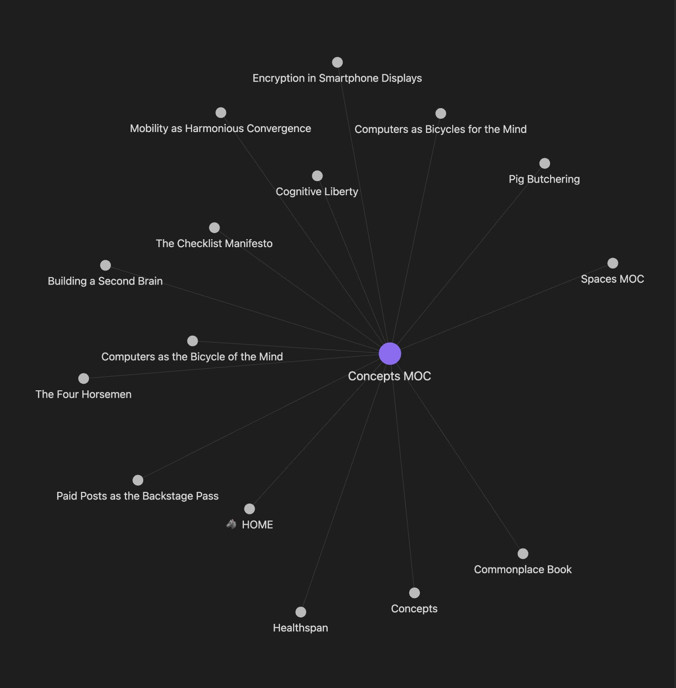
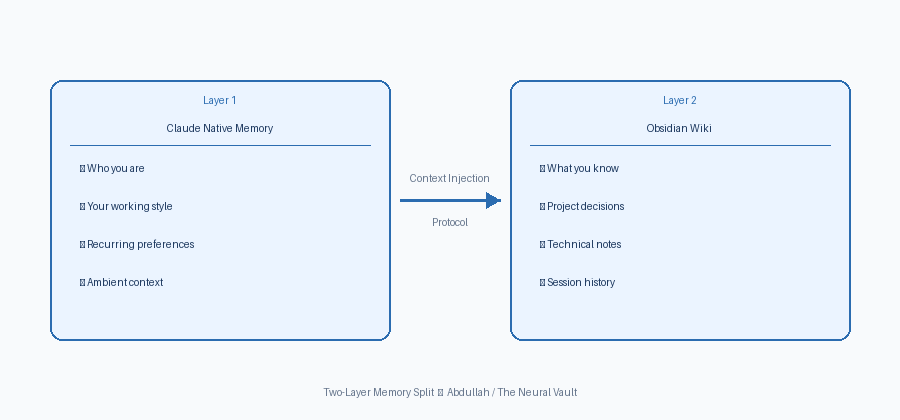

## The Problem: AI Amnesia {.smaller}

**Every time you open a new chat, the AI starts from scratch.**

::: {.incremental}
- **Constant Re-explaining**: You spend the first ten minutes rebuilding context — your project, your conventions, your decisions, your background. Then the session ends. Next time, you do it again.
- **Nothing Accumulates**: The model is sharp but stateless. That statelessness is the real ceiling, not the model's intelligence.
- **Enterprise Solutions Are Complex**: Tools like RAG and vector databases exist, but they take time to learn, cost money to run, and are difficult to debug. For a single person, we need something simpler.
:::

::: {.notes}
Start by asking the room: "Has anyone here ever had to re-explain yourself to an AI that should already know you?"

That's the problem. Every time you open a new Claude or ChatGPT session, the model has no memory of you. It doesn't know your name, your project, your preferences, or what you decided last week. You're starting from zero — every single time.

The frustrating part is that the model itself is incredibly capable. The bottleneck isn't intelligence. It's context. What you put in the window determines what you get out.

And before anyone says "just use RAG" — that's a valid enterprise solution. But for one person, it's often too much. It takes time to set up, it costs money, and if it breaks, it's hard to fix. We don't need a complex database to remember our own notes. We just need a simple system.
:::

---

## How This Started {.smaller}

**A conversation about markdown files sent me down a rabbit hole.**

::: {.incremental}
- A conversation with a professor about markdown note-taking workflows was the spark. I went home that night and started building.
- I was managing complex, multi-threaded technical work and kept hitting the same wall: re-explaining context every single session.
- The result is the **Neural Vault** — a structured Obsidian vault that works alongside Claude's native memory to give you persistent, portable, project-specific context across every AI session.
- No vector database. No infrastructure. Just markdown files, a disciplined workflow, and a few shell scripts.
:::

::: {.notes}
This system didn't come from a research paper. It came from a frustrating Tuesday night.

I was in a conversation about markdown files and note-taking — and something clicked. I went home and started building. Not a prototype. The actual thing. I had a specific problem: I was doing complex, multi-threaded work and every AI session felt like meeting a colleague who had amnesia.

What I built is called the Neural Vault. The name sounds technical, but the concept is simple: it's a notebook that the AI can read. A structured set of plain text files that you paste into Claude at the start of every session — so it already knows who you are, what you're working on, and what you've already decided.

No cloud. No API. No setup beyond installing a free app. Just files, a habit, and a few scripts if you want automation.
:::

---

## Inside the Obsidian Brain {.smaller}

**Your knowledge, connected and readable by both you and the AI.**

:::: {.columns}

::: {.column width="45%"}
 

- **Inbox**: Raw capture — quick, unorganized thoughts.
- **Wiki**: Structured knowledge the AI helped you write.
- **Meta**: `About_Me`, Index, Prompts, and Session Log.
- **Archive**: Deprecated notes, kept for history.
- **Agent Sandbox**: A messy workspace for AI agents — kept separate so your vault stays clean.
:::

::: {.column width="55%"}
{width="100%" fig-align="center"}
:::

::::

::: {.notes}
So why Obsidian specifically? A few reasons — but the most important one is this: every note is a plain text file stored on your own computer. Not in a cloud. Not in a proprietary format. Just a `.md` file you can open in Notepad if you want.

That matters because LLMs read text. If your knowledge is in plain text files, you can hand it directly to an AI with no conversion, no API, no special integration. The format is already right.

The graph you're looking at is what Obsidian calls the "graph view" — it shows how your notes link to each other. Each dot is a note. Each line is a connection. As your vault grows, this becomes a visual map of your thinking.

The folder structure is simple: Inbox for raw capture, Wiki for structured knowledge, Meta for your About Me and session logs, Archive for old stuff, and Agent Sandbox for anything you let the AI write — kept separate so it doesn't pollute your curated notes.
:::

---

## Andrej Karpathy — *The AI as Librarian* {.smaller}

**His core insight: have the LLM build and maintain a persistent wiki from raw sources.**

:::: {.columns style="font-size: 0.8em;"}

::: {.column width="28%"}
{width="85%" style="border-radius: 8px; margin-top: 4px;"}

Andrej Karpathy Former Tesla AI Director OpenAI co-founder

:::

::: {.column width="72%"}
::: {.incremental}
- **The `raw/` → `wiki/` pipeline**: You dump raw notes in a folder. A prompt tells the LLM to rewrite them into clean wiki pages.
- **LLM-written, human-curated**: AI does the writing, you do the editing
- **Health checks**: Periodic passes to find gaps and stale notes
- **Web Clipper ingestion**: Articles converted to markdown automatically
:::

. . .

> *Karpathy solved how to **build** a knowledge base. He didn't solve how to **use** it in an active session.*
:::

::::

::: {.notes}
Around the same time I was building this, Andrej Karpathy — former head of AI at Tesla — published a very similar idea. 

His insight was elegant: instead of manually writing your notes, have the LLM do it. You dump raw material — articles, highlights, rough thoughts — into a folder. A prompt tells the AI to synthesize them into clean, structured wiki entries. You review and approve. Over time, you build a knowledge base that the AI helped write.

It's a brilliant system for ingesting and organizing knowledge from what you read.

But here's the gap — and this is the key distinction I want you to hold onto — Karpathy's system tells you how to *build* the vault. It doesn't tell you how to *use* it in an active working session. How do you load it into Claude? How do you make sure the model has the right context before you start? That's what I built.
:::

---

## Context Injection Protocol {.smaller}

**How to load the brain into an active session.**

:::: {.columns}

::: {.column width="45%"}
{width="100%" fig-align="center"}
:::

::: {.column width="55%" style="font-size: 0.82em;"}
::: {.incremental}
- **Two-layer memory split**: Claude holds *who you are*; Obsidian holds *what you know*. 
- **The Handshake**: A structured prompt template used at the start of every session.
- **Example Prompt**:
  *"I am starting a new session. Read the attached `About_Me.md` for my background, and `Project_Spec.md` for our current goal. Do not start working yet. Acknowledge you have read the context."*
- **The Result**: The AI starts the session already knowing your goals, your style, and what you decided yesterday.
:::
:::

::::

::: {.notes}
So how do we actually load this knowledge into the AI? I call it the Context Injection Protocol.

The diagram on the left shows the key idea: a two-layer memory split. Layer one is Claude's native memory — the ambient stuff, who you are, your working style. Layer two is your Obsidian wiki — the technical knowledge, project decisions, session history. 

The Context Injection Protocol is the bridge. It's a structured prompt template — a handshake — that you use at the start of every session to load the right parts of your vault into the model. Not everything. Just what's relevant.

For example, you might paste in a prompt that says: "I am starting a new session. Read the attached About_Me file for my background, and Project_Spec for our current goal. Do not start working yet. Acknowledge you have read the context."

The result? The AI starts the session already knowing your goals, your style, and what you decided yesterday. You never have to re-explain yourself.
:::

---

## The `COMMIT:` Flag {.smaller}

**How to improve the brain as you go.**

::: {.incremental}
- **The Mid-Session Problem**: Great ideas happen in the middle of a chat, but get lost when the chat ends.
- **The Solution**: Tell Claude to mark insights worth saving.
- **How it works**:
  *"If we reach a decision or write a good piece of code, prefix it with `COMMIT:`. This is my signal to save it to my vault."*
- **Ideas Are Never Lost**: Every good session turns into a permanent note in your notebook.
- **An Investment in the Future**: The notebook you build today will make whatever AI you use tomorrow smarter and more aligned with you.
:::

::: {.notes}
Loading the brain is step one. Step two is improving it as you work.

The problem is that great ideas happen in the middle of a chat. But when the chat ends, those ideas are gone. 

The solution is something I call the COMMIT flag. In my initial instructions, I tell Claude: "If we reach a decision or write a good piece of code, prefix it with the word COMMIT."

When I see that word pop up in the chat, it's my signal. I know I need to copy that specific block of text and save it into my Obsidian vault before I close the window. Nothing gets lost.

Because of this, every good session turns into a permanent note in your notebook. You are constantly adding to your vault as you work with AI. 

And that's the real power of this system. The notebook you build today will make whatever AI you use tomorrow smarter and more aligned with you. You are investing in future you.
:::

---

## Access the Full System {data-incremental="false" .smaller}

**All scripts, templates, and documentation — open source on GitHub.**

:::: {.columns}

::: {.column width="55%"}
 

The complete Neural Vault system is available on GitHub, including:

- The full vault folder structure
- The Context Injection Protocol prompt template
- The `vault-autosave.sh` daemon script
- The `About_Me.md` starter template
- This presentation (`.qmd` source)

**github.com/rsm-aaljarallah**
:::

::: {.column width="45%"}
{width="65%" fig-align="center"}
:::

::::

::: {.notes}
Everything I've shown you today is on GitHub — free, open source, ready to use.

Scan the QR code or go to github.com/rsm-aaljarallah and find the neural-vault repo. You'll find the folder structure guide, the About Me template to fill in, the Context Injection Protocol prompt, and the auto-save script if you want to set up versioning.

The presentation itself is also in the repo as a Quarto `.qmd` file — so if you want to adapt it, fork it, or build on it, everything is there.

I'm happy to take questions. And if you want to go deeper on any part of this — the vault structure, the injection protocol, the auto-save setup — come find me after.
:::
